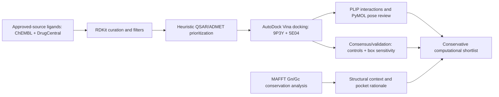

# Manuscript draft: reproducible in silico drug-repurposing and Gn/Gc conservation analysis for Andes orthohantavirus targets 9P3Y and 5E04

**Article type:** computational drug repurposing / structural bioinformatics manuscript draft  
**Status:** manuscript-ready draft; requires author review, journal formatting, and independent validation before submission.  
**Important boundary:** strictly computational; no molecular dynamics, wet-lab protocol, viral culture, pathogen manipulation, clinical recommendation, or efficacy claim.

## Abstract
Andes orthohantavirus remains a clinically relevant zoonotic pathogen for which computational repurposing can help prioritize small molecules for non-operational follow-up studies. Here we describe a reproducible in silico screening and structural-context analysis against two Andes virus protein structures: the Gn/Gc glycoprotein-related complex PDB 9P3Y and the nucleoprotein PDB 5E04. Approved-source ligands from ChEMBL and DrugCentral were standardized, deduplicated by InChIKey, filtered using RDKit descriptors and medicinal-chemistry alerts, prioritized using a transparent heuristic QSAR/ADMET layer, and docked with AutoDock Vina. The final run assembled 4,986 source records, collapsed them to 3,460 unique ligands, retained 934 after preprocessing, and docked the top 93 filtered compounds. Docking and consensus analysis prioritized several approved or clinical molecules, with the best single Vina score observed for paroxetine against 5E04 (-8.730 kcal/mol), while receptor-level patterns favored 5E04 over 9P3Y. PLIP-based interaction annotation and PyMOL pose rendering supported structural inspection of recurrent residue contacts, and a parallel Gn/Gc sequence-conservation analysis contextualized the exploratory glycoprotein pocket relative to conserved and variable regions across representative orthohantaviruses. All results are presented as computational hypotheses only; docking scores, heuristic ADMET flags, and conservation patterns do not establish antiviral activity, binding affinity, clinical utility, or experimental validation.

## Keywords
Andes orthohantavirus; hantavirus; drug repurposing; AutoDock Vina; PLIP; ChEMBL; DrugCentral; Gn/Gc glycoprotein; nucleoprotein; sequence conservation.

## Graphical workflow

## Introduction
Orthohantaviruses encode envelope glycoproteins and nucleoprotein functions that are central to viral entry, genome organization, and replication-cycle biology. From a computational drug-repurposing perspective, structurally resolved viral proteins can be used to prioritize already characterized compounds for expert review before any experimental work is considered. This study focuses on two Andes virus structures with complementary hypotheses: PDB 9P3Y, a glycoprotein-complex-related structure with an exploratory glycan-associated surface pocket, and PDB 5E04, an Andes virus nucleoprotein structure with a structurally motivated RNA-binding or RNA-proximal crevice. The goal was not to identify an antiviral drug, but to generate a transparent and reproducible shortlist of putative in silico hits while explicitly documenting methodological limitations.

### Study rationale
For 5E04, the selected site was treated as a structurally motivated nucleoprotein pocket related to the RNA-binding surface, without assuming that it captures the full viral ribonucleoprotein context. For 9P3Y, the selected pocket was interpreted as an exploratory Gn/Gc surface pocket associated with the NAG/glycan-proximal architecture. Residues involved in the predicted paroxetine-associated pocket, including ALA310, PRO311, SER332, ARG199, and GLN335 when present in the docking/interaction records, have not been directly validated as receptor-binding determinants. Their location in the surface-exposed glycoprotein architecture supports only a cautious hypothesis that this region could relate to attachment, spike stability, or antigenic modulation. Because hantavirus membrane fusion is primarily mediated by Gc class II fusion machinery, this Gn-associated pocket should not be described as a canonical fusion-loop target.

## Materials and Methods
### Computational reproducibility
The workflow was executed as a timestamped, configuration-driven Python pipeline. Previous outputs were not silently overwritten, and run metadata were retained with the output bundle.
| Field | Value |
| --- | --- |
| Run ID | 20260513T082956Z_full_70f1959a |
| Screening mode | full |
| Random seed | 42 |
| Python | 3.12.3 |
| Operating system | Linux-6.6.87.2-microsoft-standard-WSL2-x86_64-with-glibc2.39 |
| AutoDock Vina | AutoDock Vina v1.2.5 recorded in original report |
| Ligand sources | ChEMBL approved/clinical and DrugCentral approved molecules |

### Ligand-library assembly
Approved-source records were collected from public ChEMBL and DrugCentral sources, deduplicated by InChIKey, and processed as a repurposing-only library.
| Source | Records | Scope |
|---|---:|---|
| ChEMBL | 3127 | max_phase=4 / approved or clinical-stage small molecules |
| DrugCentral | 1859 | FDA-approved public compounds |
| Combined raw records | 4986 | before deduplication |
| Unique ligands | 3460 | after InChIKey deduplication |

### Ligand preparation and filtering
RDKit was used for parsing, salt/fragment handling, neutralization where appropriate, descriptor calculation, 3D conformer generation, force-field minimization, and docking-format export. Lipinski, Veber, PAINS, and BRENK filters were applied conservatively. Rejected ligands were recorded with rejection reasons.

### Receptor preparation and docking
PDB 9P3Y and 5E04 were prepared as docking receptors. Docking boxes were defined in configuration rather than inferred automatically. AutoDock Vina was used for molecular docking; scores are reported in kcal/mol as Vina scoring-function outputs, not experimental affinities.

### QSAR, ADMET, consensus, and interaction analysis
No validated local Andes-virus QSAR model was supplied; therefore, the QSAR layer used a transparent heuristic baseline. ADMET/off-target interpretation used RDKit and rule-based descriptors. Consensus rescoring, docking-box sensitivity analysis, PLIP interaction annotation, chemical diversity analysis, and PyMOL pose rendering were used to support robustness and structural inspection without making biological claims.

### Gn/Gc conservation analysis
Representative GPC sequences from Andes, Sin Nombre, Hantaan, Puumala, Seoul, and additional orthohantaviruses were aligned with MAFFT. Conservation, entropy, pairwise identity, estimated Gn/Gc boundaries, WAASA-like cleavage-region mapping, and regional alignments were computed relative to the Andes reference sequence.

## Results
### Screening throughput
| Metric | Value |
|---|---:|
| Raw fetched ligands | 4986 |
| Unique deduplicated ligands | 3460 |
| Accepted after preprocessing | 934 |
| Rejected during preprocessing | 2526 |
| Selected for docking | 93 |
| Vina pose rows | 1671 |

The filtering stage reduced the approved-source chemical universe to a docking subset corresponding to the top 10% of accepted ligands.

### Target structural rationale
| pdb_id | protein_complex_name | virus_or_organism | experimental_method | resolution_angstrom | selected_chain | selected_site | crystallographic_ligands | pocket_rationale | site_limitation |
| --- | --- | --- | --- | --- | --- | --- | --- | --- | --- |
| 9P3Y | Andes virus glycoprotein tetramer in complex with ADI-65534 Fab | Andes virus | ELECTRON MICROSCOPY | unavailable | A | site_1 | NAG | Exploratory glycan-associated / NAG-associated pocket suggested by the prepared structure. | EM structure with substantial missing-residue annotations; pocket is exploratory and not v... |
| 5E04 | Crystal structure of Andes virus nucleoprotein | Andes virus | X-RAY DIFFRACTION | 2.25 | A | site_1 | none | Structurally motivated RNA-binding crevice in the nucleoprotein core region. | X-ray structure is informative but does not represent the complete viral ribonucleoprotein... |

### Top computationally prioritized candidates
| rank_position | ligand_id | best_receptor_id | best_docking_score_kcal_mol | best_score__5E04 | best_score__9P3Y | qsar_score | admet_score | composite_score | qed | logp | tpsa |
| --- | --- | --- | --- | --- | --- | --- | --- | --- | --- | --- | --- |
| 1 | PAROXETINE_chembl490 | 50000.0 | -8.73 | -8.73 | -6.001 | 0.8087962962962962 | 0.713 | 0.8814599665614418 | 0.934 | 3.327 | 39.72 |
| 2 | MINAPRINE_chembl278819 | 50000.0 | -7.9 | -7.9 | -5.883 | 0.8048611111111111 | 0.768 | 0.7886307999068312 | 0.917 | 2.196 | 50.28 |
| 3 | dolasetron_dc3931 | 50000.0 | -7.811 | -7.811 | -6.18 | 0.7921296296296295 | 0.767 | 0.7764347241632403 | 0.862 | 2.519 | 62.4 |
| 4 | LEFLUNOMIDE_chembl960 | 50000.0 | -7.791 | -7.791 | -5.632 | 0.79125 | 0.718 | 0.7600114808208118 | 0.911 | 3.254 | 55.13 |
| 5 | NATEGLINIDE_chembl783 | 50000.0 | -7.524 | -7.524 | -6.313 | 0.7884259259259258 | 0.79 | 0.7456857313225832 | 0.846 | 3.261 | 66.4 |
| 6 | DAPIPRAZOLE_chembl1201216 | 50000.0 | -7.557 | -7.557 | -6.148 | 0.7925925925925924 | 0.77 | 0.7455040715567784 | 0.864 | 2.288 | 37.19 |
| 7 | AGOMELATINE_chembl10878 | 50000.0 | -7.547 | -7.547 | -5.51 | 0.7999999999999998 | 0.77 | 0.7417516340720293 | 0.896 | 2.527 | 38.33 |
| 8 | INDOPROFEN_chembl15870 | 50000.0 | -7.543 | -7.543 | -5.924 | 0.8012962962962963 | 0.734 | 0.7369739831235105 | 0.94 | 3.035 | 57.61 |
| 9 | CINOXACIN_chembl1208 | 50000.0 | -7.482 | -7.482 | -5.358 | 0.7921296296296295 | 0.762 | 0.7295241098563212 | 0.862 | 0.843 | 90.65 |
| 10 | INDAPAMIDE_chembl406 | 50000.0 | -7.351 | -7.351 | -6.343 | 0.7897685185185186 | 0.738 | 0.7148324456490813 | 0.871 | 2.083 | 92.5 |
| 11 | TOLAZAMIDE_chembl817 | 50000.0 | -7.174 | -7.174 | -6.116 | 0.799074074074074 | 0.831 | 0.7123028301732113 | 0.892 | 1.774 | 78.51 |
| 12 | PREDNISONE_chembl635 | NA | NA | NA | NA | 0.7743055555555555 | 0.89 | 0.7014330808080808 | 0.785 | 1.766 | 91.67 |
| 13 | MEPREDNISONE_chembl1201148 | NA | NA | NA | NA | 0.7717592592592591 | 0.889 | 0.7006725589225589 | 0.774 | 2.012 | 91.67 |
| 14 | tramadol_dc2711 | 50000.0 | -7.098 | -7.098 | -4.8 | 0.8023148148148148 | 0.838 | 0.6990199876642872 | 0.906 | 2.635 | 32.7 |
| 15 | TRAMADOL_chembl1237044 | 50000.0 | -7.092 | -7.092 | -4.861 | 0.8023148148148148 | 0.838 | 0.6982778194915833 | 0.906 | 2.635 | 32.7 |
The leading candidates should be described as computationally prioritized or putative in silico hits. Clinical approval or prior therapeutic use does not imply antiviral activity.

### Receptor-wise docking pattern

| receptor_id | ligand_id | best_receptor_score_kcal_mol | best_binding_site_id |
| --- | --- | --- | --- |
| 5E04 | PAROXETINE_chembl490 | -8.73 | site_1 |
| 5E04 | MINAPRINE_chembl278819 | -7.9 | site_1 |
| 5E04 | dolasetron_dc3931 | -7.811 | site_1 |
| 5E04 | LEFLUNOMIDE_chembl960 | -7.791 | site_1 |
| 5E04 | DAPIPRAZOLE_chembl1201216 | -7.557 | site_1 |
| 9P3Y | GRANISETRON_chembl289469 | -6.523 | site_1 |
| 9P3Y | GREPAFLOXACIN_chembl583 | -6.472 | site_1 |
| 9P3Y | NALTREXONE_chembl19019 | -6.446 | site_1 |
| 9P3Y | LEVOFLOXACIN_ANHYDROUS_chembl33 | -6.368 | site_1 |
| 9P3Y | INDAPAMIDE_chembl406 | -6.343 | site_1 |

The docking distribution favored 5E04 relative to 9P3Y in the archived run. This is a scoring-function pattern, not evidence that one target is biologically more druggable.

### Docking protocol validation and sensitivity
| analysis_type | group | ligand_count | mean_best_score | median_best_score | best_score | worst_score | note |
| --- | --- | --- | --- | --- | --- | --- | --- |
| docking_validation | control | 3 | NA | NA | NA | NA | Reference/control compounds for computational comparison only |
| docking_validation | decoy | 30 | NA | NA | NA | NA | Background decoys or top-ranked candidates |
| docking_validation | top_hit | 93 | -7.418 | -7.263 | -8.73 | -6.974 | Background decoys or top-ranked candidates |
Control and decoy comparisons were used only as internal computational references. Docking-box perturbation analysis evaluated whether top-ranked ligands were sensitive to modest changes in box definition.

### Consensus rescoring
| consensus_position | ligand_id | receptor_id | vina_score | secondary_score | secondary_tool | rank_stability |
| --- | --- | --- | --- | --- | --- | --- |
| 1 | PAROXETINE_chembl490 | 5E04 | -8.73 | -6.04 | vina_vinardo | 0.0 |
| 2 | LEFLUNOMIDE_chembl960 | 5E04 | -7.791 | -5.819 | vina_vinardo | 0.0 |
| 3 | MINAPRINE_chembl278819 | 5E04 | -7.9 | -5.372 | vina_vinardo | 0.0 |
| 4 | AGOMELATINE_chembl10878 | 5E04 | -7.547 | -5.756 | vina_vinardo | 0.0 |
| 5 | NATEGLINIDE_chembl783 | 5E04 | -7.524 | -6.037 | vina_vinardo | 0.0 |
| 6 | INDOPROFEN_chembl15870 | 5E04 | -7.543 | -5.474 | vina_vinardo | 0.0 |
| 7 | DAPIPRAZOLE_chembl1201216 | 5E04 | -7.557 | -4.958 | vina_vinardo | 0.0 |
| 8 | dolasetron_dc3931 | 5E04 | -7.811 | -4.66 | vina_vinardo | 0.0 |
| 9 | INDAPAMIDE_chembl406 | 5E04 | -7.351 | -5.221 | vina_vinardo | 0.0 |
| 10 | MAVACAMTEN_chembl4297517 | 5E04 | -7.15 | -5.104 | vina_vinardo | 0.0 |
| 11 | CINOXACIN_chembl1208 | 5E04 | -7.482 | -4.931 | vina_vinardo | 0.0 |
| 12 | TOLAZAMIDE_chembl817 | 5E04 | -7.174 | -4.948 | vina_vinardo | 0.0 |
| 13 | tramadol_dc2711 | 5E04 | -7.098 | -5.035 | vina_vinardo | 0.0 |
| 14 | TRAMADOL_chembl1237044 | 5E04 | -7.092 | -5.102 | vina_vinardo | 0.0 |
| 15 | NORFLOXACIN_chembl9 | 5E04 | -7.154 | -3.914 | vina_vinardo | 0.0 |
Consensus ranking used rank-normalized scoring information where secondary scores were available. This improves robustness of prioritization but does not estimate true binding free energy.

### Clinical repurposing context
| ligand_id | approval_status | therapeutic_class_or_indication | computational_rank | best_receptor | best_docking_score_kcal_mol | qed | clogp | tpsa | safety_interpretation_warning |
| --- | --- | --- | --- | --- | --- | --- | --- | --- | --- |
| PAROXETINE_chembl490 | approved | CNS-active SSRI | 1 | 50000.0 | -8.73 | 0.934 | 3.327 | 39.72 | CNS-off-target profile may complicate repurposing interpretation. Clinical approval does n... |
| MINAPRINE_chembl278819 | approved | Historical CNS-active agent | 2 | 50000.0 | -7.9 | 0.917 | 2.196 | 50.28 | Legacy compounds may have limited translational value. Clinical approval does not imply an... |
| dolasetron_dc3931 | approved | Antiemetic 5-HT3 antagonist | 3 | 50000.0 | -7.811 | 0.862 | 2.519 | 62.4 | Use as a repurposing candidate only in a computational context. Clinical approval does not... |
| LEFLUNOMIDE_chembl960 | approved | Immunomodulatory disease-modifying agent | 4 | 50000.0 | -7.791 | 0.911 | 3.254 | 55.13 | Immune-modulating pharmacology requires cautious interpretation. Clinical approval does no... |
| NATEGLINIDE_chembl783 | approved | Antidiabetic agent | 5 | 50000.0 | -7.524 | 0.846 | 3.261 | 66.4 | Metabolic pharmacology should not be overinterpreted as antiviral activity. Clinical appro... |
| DAPIPRAZOLE_chembl1201216 | approved | Ophthalmic alpha-adrenergic antagonist | 6 | 50000.0 | -7.557 | 0.864 | 2.288 | 37.19 | Local ophthalmic use limits direct translational inference. Clinical approval does not imp... |
| AGOMELATINE_chembl10878 | approved | Melatonergic antidepressant | 7 | 50000.0 | -7.547 | 0.896 | 2.527 | 38.33 | CNS activity warrants cautious interpretation. Clinical approval does not imply antiviral ... |
| INDOPROFEN_chembl15870 | approved | NSAID | 8 | 50000.0 | -7.543 | 0.94 | 3.035 | 57.61 | Anti-inflammatory action does not imply antiviral efficacy. Clinical approval does not imp... |
| CINOXACIN_chembl1208 | approved | Quinolone antibacterial | 9 | 50000.0 | -7.482 | 0.862 | 0.843 | 90.65 | Antibacterial class does not imply antiviral activity. Clinical approval does not imply an... |
| INDAPAMIDE_chembl406 | approved | Thiazide-like diuretic | 10 | 50000.0 | -7.351 | 0.871 | 2.083 | 92.5 | A diuretic scaffold is not evidence of target engagement. Clinical approval does not imply... |
The table provides pharmacological context only. It should be used to identify interpretive cautions, not to infer antiviral efficacy.

### ADMET/off-target computational flags
| ligand_id | molecular_weight | logp | tpsa | rotatable_bonds | formal_charge | high_lipophilicity | high_tpsa | cns_penetration_proxy | herg_risk_proxy |
| --- | --- | --- | --- | --- | --- | --- | --- | --- | --- |
| PAROXETINE_chembl490 | 329.371 | 3.327 | 39.72 | 4 | 0 | False | False | True | True |
| MINAPRINE_chembl278819 | 298.39 | 2.196 | 50.28 | 5 | 0 | False | False | True | False |
| dolasetron_dc3931 | 324.38 | 2.519 | 62.4 | 2 | 0 | False | False | True | False |
| LEFLUNOMIDE_chembl960 | 270.21 | 3.254 | 55.13 | 2 | 0 | False | False | True | True |
| NATEGLINIDE_chembl783 | 317.429 | 3.261 | 66.4 | 6 | 0 | False | False | True | True |
| DAPIPRAZOLE_chembl1201216 | 325.46 | 2.288 | 37.19 | 4 | 0 | False | False | True | False |
| AGOMELATINE_chembl10878 | 243.306 | 2.527 | 38.33 | 4 | 0 | False | False | True | False |
| INDOPROFEN_chembl15870 | 281.311 | 3.035 | 57.61 | 3 | 0 | False | False | True | True |
| CINOXACIN_chembl1208 | 262.221 | 0.843 | 90.65 | 2 | 0 | False | False | False | False |
| INDAPAMIDE_chembl406 | 365.842 | 2.083 | 92.5 | 3 | 0 | False | False | False | False |
| TOLAZAMIDE_chembl817 | 311.407 | 1.774 | 78.51 | 3 | 0 | False | False | True | False |
| PREDNISONE_chembl635 | 358.434 | 1.766 | 91.67 | 2 | 0 | False | False | False | False |
| MEPREDNISONE_chembl1201148 | 372.461 | 2.012 | 91.67 | 2 | 0 | False | False | False | False |
| tramadol_dc2711 | 263.381 | 2.635 | 32.7 | 4 | 0 | False | False | True | False |
| TRAMADOL_chembl1237044 | 263.381 | 2.635 | 32.7 | 4 | 0 | False | False | True | False |
These are computational risk flags and proxies, not safety conclusions.

### Chemical diversity and scaffold distribution
| scaffold | count |
| --- | --- |
| O=C1C=CC2C(=C1)CCC1C3CCCC3CC(=O)C21 | 2 |
| c1ccc(C2CCCCC2)cc1 | 2 |
| c1ccc(C2CCNCC2COc2ccc3c(c2)OCO3)cc1 | 1 |
| c1ccc(-c2ccc(NCCN3CCOCC3)nn2)cc1 | 1 |
| O=C(OC1CC2CC3CC(C1)N2CC3=O)c1c[nH]c2ccccc12 | 1 |
| O=C(Nc1ccccc1)c1cnoc1 | 1 |
| O=C(NCCc1ccccc1)C1CCCCC1 | 1 |
| c1ccc(N2CCN(CCc3nnc4n3CCCC4)CC2)cc1 | 1 |
| c1ccc2ccccc2c1 | 1 |
| O=C1c2ccccc2CN1c1ccccc1 | 1 |
| O=c1cn[nH]c2cc3c(cc12)OCO3 | 1 |
| O=C(NN1CCc2ccccc21)c1ccccc1 | 1 |
The scaffold table and fingerprint visualizations help determine whether the shortlist is chemically diverse or dominated by repeated cores.

### Residue-level interaction fingerprinting
| receptor_residue | count | persistence_fraction |
| --- | --- | --- |
| TYR364 | 10 | 1.0 |
| TYR125 | 8 | 0.8 |
| PHE360 | 7 | 0.7 |
| ARG367 | 7 | 0.7 |
| ALA310 | 6 | 0.6 |
| VAL219 | 5 | 0.5 |
| ARG199 | 5 | 0.5 |
| ASP312 | 4 | 0.4 |
| ARG156 | 4 | 0.4 |
| GLN335 | 3 | 0.3 |
| ARG146 | 3 | 0.3 |
| ILE193 | 2 | 0.2 |
| PHE307 | 2 | 0.2 |
| TYR178 | 2 | 0.2 |
| GLU191 | 1 | 0.1 |
Recurrent interactions suggest pose consistency within the docking/PLIP workflow, but they do not confirm binding in solution or cellular activity.

### Gn/Gc conservation context
| ANDV_region_estimate | n_alignment_columns | mean_identity_percent | median_identity_percent | mean_gap_percent | mean_entropy_norm |
| --- | --- | --- | --- | --- | --- |
| Gc_estimated | 487 | 78.17 | 91.67 | 0.09 | 0.159 |
| Gn_estimated | 651 | 70.06 | 66.67 | 0.35 | 0.224 |
The estimated Gc region was more conserved than the estimated Gn region in the curated alignment. Regional alignments identify conserved windows and variable segments that should guide cautious interpretation of surface-pocket hypotheses.

### Regional alignments selected for the manuscript
| roi_id | region_name | ANDV_start | ANDV_end | length_aa_ANDV | mean_identity_percent | mean_entropy_norm | fasta | figure | rationale |
| --- | --- | --- | --- | --- | --- | --- | --- | --- | --- |
| roi_gn_conserved_2 | High-conservation Gn window 2 | 379 | 409 | 31 | 88.71 | 0.068 | roi_gn_conserved_2.fasta | figures/regional_alignments/roi_gn_conserved_2.png | Automatically selected 31-aa Gn window with high mean column identity (88.7%). |
| roi_gn_conserved_1 | High-conservation Gn window 1 | 435 | 465 | 31 | 93.28 | 0.058 | roi_gn_conserved_1.fasta | figures/regional_alignments/roi_gn_conserved_1.png | Automatically selected 31-aa Gn window with high mean column identity (93.3%). |
| roi1_waasa_cleavage | WAASA cleavage / Gn-Gc junction | 621 | 681 | 61 | 76.09 | 0.178 | roi1_waasa_cleavage.fasta | figures/regional_alignments/roi1_waasa_cleavage.png | Motif-centered region around the conserved WAASA-like Gn/Gc cleavage junction. |
| roi2_gc_nterm | N-terminal Gc segment after WAASA | 652 | 720 | 69 | 71.98 | 0.213 | roi2_gc_nterm.fasta | figures/regional_alignments/roi2_gc_nterm.png | Immediate post-cleavage Gc segment; useful for comparing conservation at the beginning of ... |
| roi_gc_conserved_2 | High-conservation Gc window 2 | 758 | 788 | 31 | 89.25 | 0.08 | roi_gc_conserved_2.fasta | figures/regional_alignments/roi_gc_conserved_2.png | Automatically selected 31-aa Gc window with high mean column identity (89.2%). |
| roi_gc_conserved_1 | High-conservation Gc window 1 | 983 | 1013 | 31 | 89.52 | 0.08 | roi_gc_conserved_1.fasta | figures/regional_alignments/roi_gc_conserved_1.png | Automatically selected 31-aa Gc window with high mean column identity (89.5%). |
| roi3_cterm_tm_proximal | C-terminal transmembrane-proximal segment | 1060 | 1138 | 79 | 74.1 | 0.19 | roi3_cterm_tm_proximal.fasta | figures/regional_alignments/roi3_cterm_tm_proximal.png | C-terminal hydrophobic/transmembrane-proximal region of ANDV GPC; alignment is useful for ... |

### Integration of glycoprotein conservation with docking hypotheses
The glycoprotein-associated docking hypothesis should be framed as exploratory. The predicted paroxetine-associated pocket is located within the surface-exposed glycoprotein architecture and includes residues such as ALA310, PRO311, SER332, ARG199, and GLN335 in the structural interaction records. These residues are not established receptor-binding determinants. Because membrane fusion in hantaviruses is primarily mediated by Gc class II fusion loops, this site is better described as a putative attachment-, spike-stability-, or entry-modulatory surface pocket rather than a canonical fusion-loop target.

## Discussion
This integrated analysis combines a repurposing-focused docking screen with structural interaction annotation and independent Gn/Gc conservation mapping. The strongest computational signal in the docking screen was observed for 5E04, with paroxetine ranking first in the archived composite analysis. However, the result must be interpreted through the limitations of rigid-receptor docking, scoring-function bias, heuristic QSAR/ADMET proxies, and uncertain pocket biology. The conservation analysis adds useful structural context by distinguishing conserved Gc-associated segments from more variable Gn-associated regions, but sequence conservation alone does not establish ligandability or functional inhibition.

The appropriate interpretation is a conservative shortlist of compounds and target-site hypotheses for future independent validation. The data support prioritization and manuscript-level transparency, not therapeutic claims.

## Limitations
- Docking scores are not experimental affinities and should not be interpreted as binding free energies.
- Protein receptors were treated with limited flexibility; receptor dynamics and conformational ensembles were not modeled in this manuscript version.
- Scoring-function bias can reorder chemically distinct ligands; consensus rescoring reduces but does not remove this uncertainty.
- The QSAR and ADMET layers are heuristic/rule-based unless explicitly labeled as model-based; they do not establish activity or safety.
- Ligand protonation, tautomeric state, and stereochemical uncertainty can alter docking outcomes.
- Selected docking boxes bias the searched pocket volume; box-sensitivity analysis assesses robustness but does not validate druggability.
- The 9P3Y NAG/glycan-associated pocket is exploratory and should not be overinterpreted as a validated antiviral target.
- The 5E04 pocket does not represent the full viral ribonucleoprotein state.
- No molecular dynamics results are included in this manuscript-ready version by request.
- No biochemical, biophysical, cellular, animal, or clinical validation is included.

## Non-operational validation roadmap
Future validation, if pursued by qualified laboratories under appropriate biosafety and ethical oversight, should remain high-level and orthogonal: purified-protein binding assays, RNA-protein displacement concepts for nucleoprotein hypotheses, independent biophysical confirmation, cytotoxicity counterscreening, and pseudotyped-entry assay concepts for glycoprotein-related hypotheses. No operational pathogen-handling protocol is provided here.

## Figure list
| Figure | Title | File | Included in HTML |
|---|---|---|---|
| Figure 1 | Study design and cross-target computational workflow | Mermaid schematic | yes |

| Figure 2 | Gn/Gc conservation landscape across representative orthohantaviruses | `figures/rolling_conservation_landscape.png` | yes |

| Figure 3 | Pairwise identity matrix for curated GPC sequences | `figures/pairwise_identity_heatmap.png` | yes |

| Figure 4 | Regional alignment of the WAASA-like Gn/Gc junction | `figures/roi1_waasa_cleavage.png` | yes |

| Figure 5 | Docking score distribution by receptor | `figures/01_docking_score_violin_by_receptor.png` | yes |

| Figure 6 | Top-hit receptor score heatmap | `figures/02_top_hits_receptor_heatmap.png` | yes |

| Figure 7 | Composite prioritization components for top candidates | `figures/03_top10_composite_breakdown.png` | yes |

| Figure 8 | Docking box sensitivity analysis | `figures/docking_box_sensitivity_heatmap.png` | yes |

| Figure 9 | Consensus rescoring heatmap | `figures/consensus_score_heatmap.png` | yes |

| Figure 10 | Chemical space map | `figures/chemical_space_map.png` | yes |

| Figure 11 | Top-hit ADMET/risk-flag matrix | `figures/top_hit_admet_matrix.png` | yes |

| Figure 12 | Residue-level interaction fingerprinting | `figures/ligand_residue_interaction_heatmap.png` | yes |

| Figure 13 | PyMOL-rendered docking pose gallery | `figures/plip_pymol_contact_sheet.png` | yes |

## Figures
### Figure 1. Study design and cross-target computational workflow

### Figure 2. Gn/Gc conservation landscape across representative orthohantaviruses

Rolling ANDV-referenced conservation profile showing estimated Gn/Gc regions and conserved sequence windows.

### Figure 3. Pairwise identity matrix for curated GPC sequences

Pairwise sequence identity among selected Andes, Sin Nombre, Hantaan, Puumala, Seoul, and additional orthohantavirus GPC sequences.

### Figure 4. Regional alignment of the WAASA-like Gn/Gc junction

Alignment of the WAASA-like Gn/Gc cleavage-region window; additional regional alignment panels are supplementary.

### Figure 5. Docking score distribution by receptor

Distribution of Vina docking scores for the screened ligand subset across 9P3Y and 5E04.

### Figure 6. Top-hit receptor score heatmap

Best Vina scores for top-ranked candidates against each receptor.

### Figure 7. Composite prioritization components for top candidates

Contribution of docking, heuristic QSAR, ADMET, drug-likeness, toxicity, and multi-target terms.

### Figure 8. Docking box sensitivity analysis

Sensitivity of selected top ligands to small docking-box perturbations.

### Figure 9. Consensus rescoring heatmap

Normalized comparison of Vina and secondary scoring information for top-ranked ligand poses.

### Figure 10. Chemical space map

Two-dimensional chemical-space projection highlighting accepted ligands and top-ranked candidates.

### Figure 11. Top-hit ADMET/risk-flag matrix

Rule-based and heuristic computational ADMET/off-target flags for prioritized compounds.

### Figure 12. Residue-level interaction fingerprinting

PLIP-derived ligand-residue interaction matrix for prioritized docking poses.

### Figure 13. PyMOL-rendered docking pose gallery

Publication-style PyMOL renderings of representative docked poses.

## Data and code availability
All tables and figures referenced in this draft were generated from local run bundles under `reports/20260513T082956Z_full_70f1959a` and `reports/20260522_gn_gc_conservation_curated`. The manuscript copy is stored in `reports/20260522_gn_gc_conservation_curated/manuscript_no_md`.

## Suggested supplementary tables
- Supplementary Table S1: selected GPC sequence set.
- Supplementary Table S2: regional conservation summary.
- Supplementary Table S3: full top-hit ranking table.
- Supplementary Table S4: docking validation and box-sensitivity summary.
- Supplementary Table S5: PLIP residue-frequency and interaction matrix.
- Supplementary Table S6: expanded ADMET/off-target computational profile.
